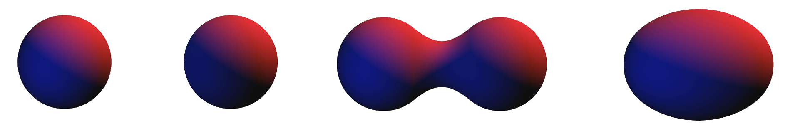
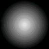
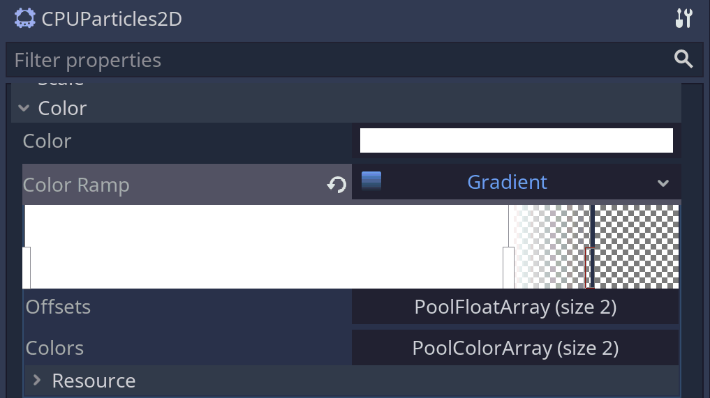

## Metaballs

While I was working on my entry *Orbits* for Ludum Dare 47 (which you can check out [here](https://ldjam.com/events/ludum-dare/47/orbits-1), by the way), I eventually wanted to add some cool looking effects to the sun that is a the center of the screen. My game uses a relatively minimalistic 2D artstyle but I still wanted to achieve the illusion of a fiery, lively corona.

{{ site.beginFigure }}

{{ site.beginCaption }}
Metaballs are used for the sun's corona in my Ludum Dare 47 entry, Orbits.
{{ site.endCaption }}
{{ site.endFigure }}

Thinking about this, I went to sleep and *just* as I was drifting away, I remembered something that I had experimented with a while earlier: [metaballs](https://en.wikipedia.org/wiki/Metaballs). These organic looking shapes have been around for a while and are well known for their ability to create organic looking "blobs" of spheres that smoothly merge. You might know them from Portal 2, where they are used for the different gels.

{{ site.beginFigure }}

{{ site.beginCaption }}
Two merging metaballs. Edited image from [Wikipedia](https://commons.wikimedia.org/wiki/File:Metaballs.png).
{{ site.endCaption }}
{{ site.endFigure }}

There are many, very similar ways of defining metaballs. However, they all include constructing isosurfaces from a sum of *falloff functions*, one for each metaball in the scene.

{{ site.beginInfoBox }}
{{ site.beginInfoBoxTitle }}
Metaballs and Isosurfaces
{{ site.endInfoBoxTitle }}
An [isosurface](https://en.wikipedia.org/wiki/Isosurface) $$S$$ of a scalar function $$\mathrm{f}: \mathbb{R}^3 \rightarrow \mathbb{R}$$ is a surface that contains only points of constant value, i.e. $$\mathrm{f}(s) = \mathrm{const.}$$ for all $$s \in S$$.

By defining a falloff function $$\mathrm{g}_i$$ for each metaball $$i$$ and adding those together, we can construct a new isosurface:

$$\begin{align}
\sum_{i = 0}^n \mathrm{g}_i(x, y, z) = \mathrm{const.}
\end{align}$$

An intuitive way of defining the falloff function is the inverse squared distance to each metaball:

$$\begin{align}
\mathrm{g}_i(x, y, z) = \frac{1}{(x_i - x)^2 + (y_i - y)^2 + (z_i - z)^2}
\end{align}$$

However, there are numerous more efficient and smoother functions.
{{ site.endInfoBox }}

Techniques for creating metaballs in 3D include [raymarching](https://www.youtube.com/watch?v=Cp5WWtMoeKg&t=1s) or [marching cubes](https://de.wikipedia.org/wiki/Marching_Cubes). In their simplest forms, they require looping through every metaball in the scene for every sample point (although much of this can be optimized).

## Metaballs in 2D

{{ site.beginInfoBox }}
{{ site.beginInfoBoxTitle }}
Godot vs. other Engines
{{ site.endInfoBoxTitle }}
While this article mainly covers the Godot Engine, I see no reason why the technique presented here shouldn't work in most other available engines like Unity or Unreal. However, since I am not as aware of their feature sets, you may be able to find more efficient ways of doing things.
{{ site.endInfoBox}}

While 2D metaballs are very similar to their 3D counterparts, we can circumvent complicated algorithms and use a trick to make our life much easier:

Instead of mathematically defining a falloff function, we use a texture. In figure 3, the alpha value of each pixel depends linearly on its distance to the texture centre: The further away a pixel, the lower its alpha value. (I simply used paint.NET's radial gradient tool for this.)

{{ site.beginFigure }}

{{ site.beginCaption }}
Base texture of the metaballs. The black background signifies transparency.
{{ site.endCaption }}
{{ site.endFigure }}

We can render this texture to a `Viewport` with a black background, retrieve the viewport's content from a `ViewportTexture` and then apply a fragment shader to only color in pixels above a certain brightness threshold. This will result in a single circle that grows larger as we lower the threshold and vice versa.

The reason we use transparent textures is that we can overlap textures this way (and again apply the thresholding) to create new shapes as shown in figure 4. While not perfect, these are very similar to the metaballs shown in figure 2.  

{{ site.beginFigure }}

{{ site.beginCaption }}
Merging 2D metaballs. The original viewport texture is on the right, the shaded result on the left.
{{ site.endCaption }}
{{ site.endFigure }}

But we don't have to stop here. We can combine more textures (and even different shapes if we wanted) to create even more complex structures. For my use, I used a `CPUParticles2D` node and assigned the texture as the draw texture. Of course, nothing stops you from using the GPU-based `Particles2D` instead (except in my case GLES2 compatibility). The result is quite mesmerizing, I think, and the imperfections from before are barely noticeable:

{{ site.beginFigure }}

{{ site.beginCaption }}
Using `CPUParticles2D` to create many metaballs.
{{ site.endCaption }}
{{ site.endFigure }}

Right now, the particles just instantly disappear after exceeding their lifetime. This does not look very convincing, especially if we want to emulate the look of soft flames. We could just change the size of the particles over time ~~but as far as I know, Godot doesn't support this feature~~. ***I stand corrected:** You can use the `scale_amount_curve` property!* Instead, I'm using a different trick: By lowering the alpha of the entire texture, we "pull" it below the threshold. This results in the metaball shrinking:

{{ site.beginFigure }}

{{ site.beginCaption }}
Changing the size of the metaball by fading the texture.
{{ site.endCaption }}
{{ site.endFigure }}

We can now assign a gradient to `CPUParticles2D.color_ramp` to fade each individual particle over time. The result we get are soft, organic fringes.

{{ site.beginFigure }}



{{ site.beginCaption }}
Fading out particles using `CPUParticles2D.color_ramp`.
{{ site.endCaption }}
{{ site.endFigure }}

By using a gradient texture where each pixel corresponds to a certain alpha range, instead of just coloring everything above a certain threshold in a solid color, we can get even more interesting effects. In this case, the gradient texture is just 5 pixels large and was imported with filering disabled to again create sharp thresholds (and suit the minimalistic look of my game).

{{ site.beginFigure }}


{{ site.beginCaption }}
Adding a gradient to the heightmap.
{{ site.endCaption }}
{{ site.endFigure }}

Figure 8 shows pretty much the final product that I also used my in jam submission (again, [check it out](https://ldjam.com/events/ludum-dare/47/orbits-1)!)

The final (Godot) shader code is just a few lines long. We can assign a gradient texture as a uniform and we only use the red channel to sample the brightness. All project files are available [here](https://github.com/CaptainProton42/2DMetaballs) under the MIT license.

```glsl
shader_type canvas_item;

uniform sampler2D gradient;

void fragment() {
	float b = texture(TEXTURE, UV).r;
	COLOR = texture(gradient, vec2(b, 0.0f));
}
```

## Further resources

There are many more in-depth resources about metaballs and possible rendering techniques out there.

I found a very good article by Myopic Rhino on gamedev.net about metaballs in 2D: [Exploring Metaballs and Isosurfaces in 2D](https://www.gamedev.net/articles/programming/graphics/exploring-metaballs-and-isosurfaces-in-2d-r2556/). It goes more in-depth about algorithms and applications and even experiments with different meta-shapes. While the techique I present here is a bit different, I took some inspiration from it.

If you are interested in 3D rendering techniques like raymarching and marching cubes, I can recommend Sebastian Lague's videos on these topics: [Coding Adventure: Ray Marching](https://youtu.be/Cp5WWtMoeKg) and [Coding Adventure: Marching Cubes](https://youtu.be/M3iI2l0ltbE).
